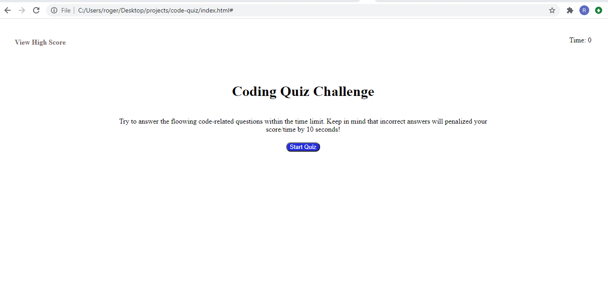
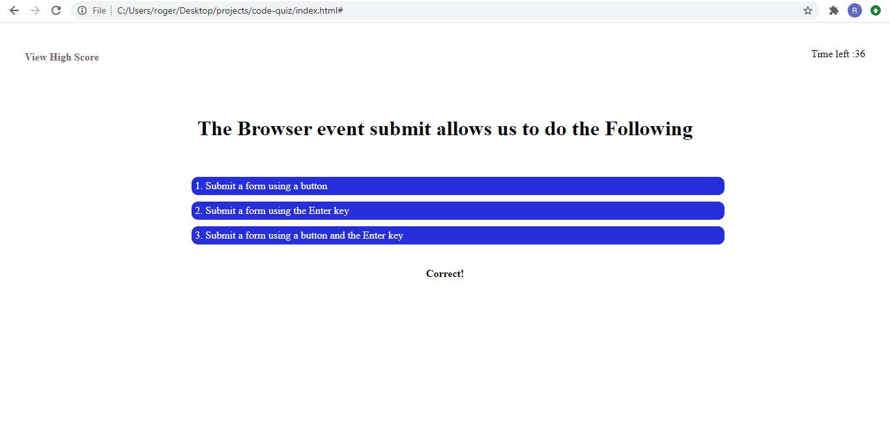
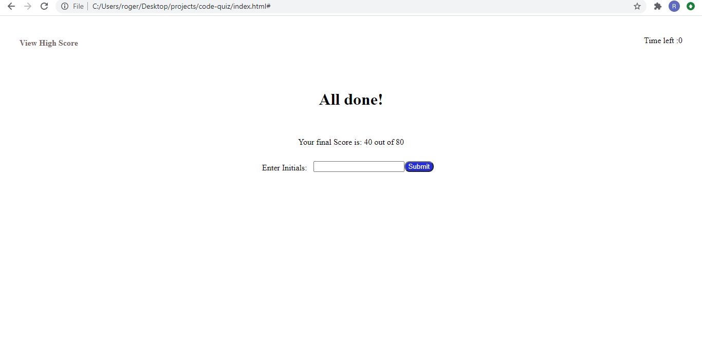
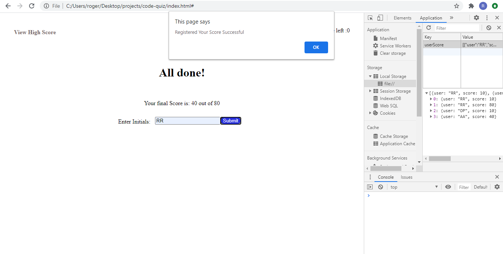
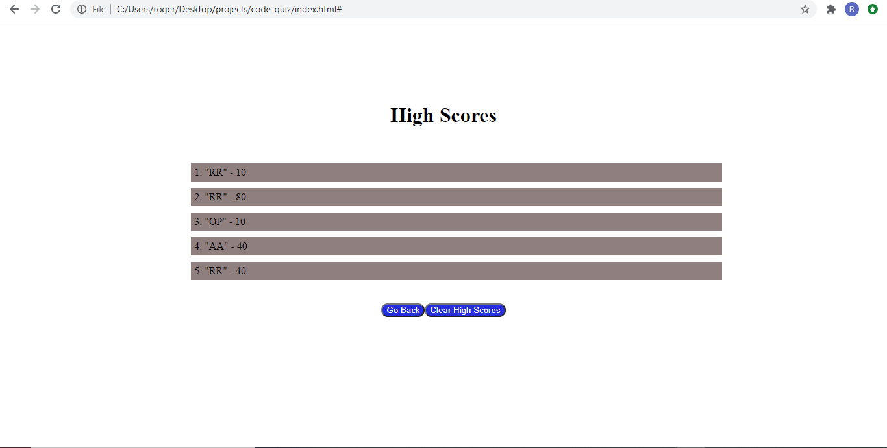

# code-quiz
4th Challenge

URLs

Deployed Application: 
    https://rogers0404.github.io/code-quiz/

GitHub Repository:
    https://github.com/rogers0404/code-quiz.git
    
    git@github.com:rogers0404/code-quiz.git 

Commits:

Fourth Assignment in UCF Code Boot Camp

1. It was Created 1 branches to work independently from the master branch
- develop

2. "develop" Branch correspond with a development in the HTML and CSS documents and Javascript

3. Defined varibles for styling: colors,  backgrounds and border-radius; timer; scores, array of object for questions, flagh; elements of DOM.

4. HTML and CSS Basis:
- As required in the Acceptance Criteria, the links work,
- It was used felxbox, and psudo clases to Styling ic CSS
- There are comments in both documents (HTML and CSS)

5. JavaScript file:
- As required in the Acceptance Criteria.
- All points in Acceptance Criteria are their comments
- There are several functions to manage all functionality, like: 
    * Functions for localStore; 
    * to show Questions, check answers, get score;
    * Timer
    * create buttons
    * Show score initials form
    * delete element from DOM
    * objetc for the score in localStore. It was used JSON to manage its content
- It was used DOM element manupulation from javascript
- And also, I was set styling from javascript using DOM

6. It was changed the way to assign score; for each question answer correctly, it was added 10 pts to the variable score.

7. In the GitHub there are all comments generated during the developing of the assignment

##Screenshots:

### Screenshot 1

### Screenshot 2

### Screenshot 3

### Screenshot 4

### Screenshot 5
